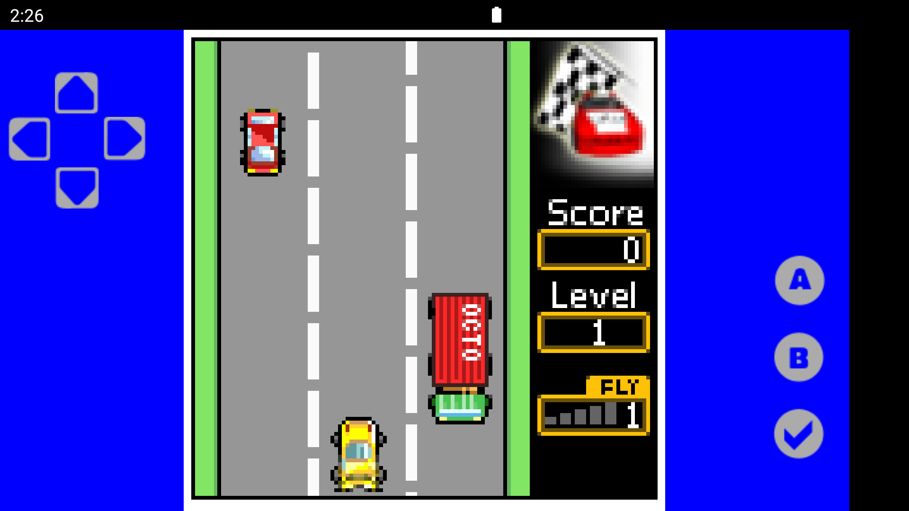

# SDL Controller



A virtual controller Android library for games made with SDL2.

## Installation

#### Gradle
```groovy
implementation 'com.ferdinandsilva.sdlcontroller:sdlcontroller:1.0.6'
```

## Usage

Extend `SDLActivity` and instantiate `SDLControllerView`

```java
import com.ferdinandsilva.sdlcontroller.SDLControllerView;

public class GameActivity extends SDLActivity {
    @Override
    protected void onCreate(Bundle savedInstanceState) {
        super.onCreate(savedInstanceState);
        SDLControllerView v = new SDLControllerView(this, mLayout);
    }
}
```